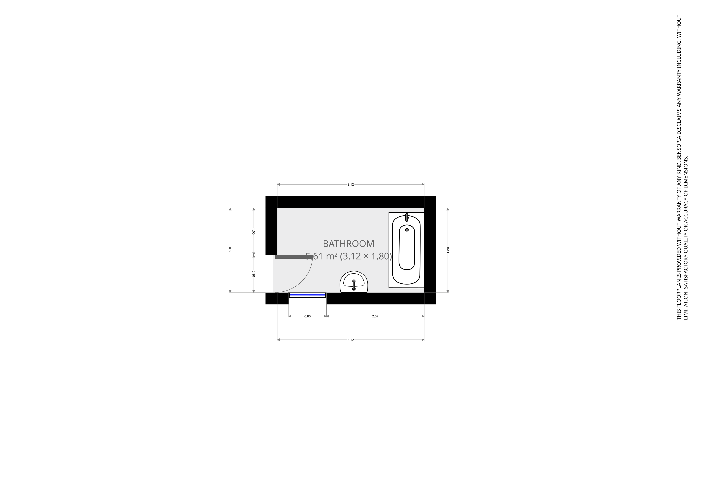
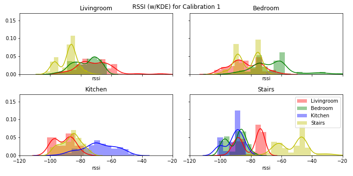
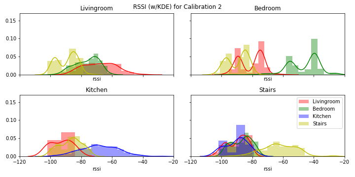
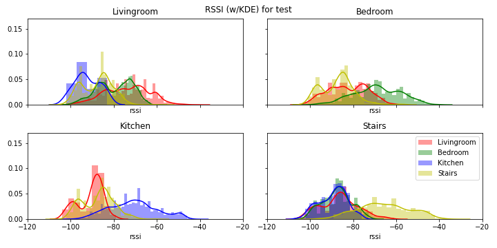

# A Dataset For Indoor Localization Using A Smart Home in a Box
This is a dataset originally collected for the paper 'Understanding the Quality of Calibrations for Indoor Localisation'.
A further description of it is available in the Data in Brief paper A dataset for indoor localization using a smart home in a box. 

# Abstract / Overview
An annotated dataset of measurements obtained using the Eurvalve Smart Home In a Box (SHIB) rehabilitation monitoring system is presented. The data is intended to evaluate indoor localization methods in a smart home environment using a wrist worn wearable. The wearable device registers tri-axial accelerometer measurements which are sampled and transmitted as the payload of a Bluetooth Low Energy (BLE) packet. Four receiving gateways, each placed in a different room throughout the SPHERE house, extract the accelerometer data and determine a Received Signal Strength Indicator (RSSI) for each received BLE packet. RSSI values can represent propagation losses due to distance or shadowing between the wearable transmitter and the gateway receiver. Data presented herein includes the ground truth location of 10 unique participants in various rooms throughout the house. 

# Floorplans of the house the data was collected in

# RSSI Distribution Examples

# Citation Information
If you use this dataset please cite the following papers:

`  @inbook{ee1ba516ee0b4bc5b3a09c6044cf1438,
  title = "Understanding the Quality of Calibrations for Indoor Localisation",
  author = "Ryan McConville and Dallan Byrne and Ian Craddock and Robert Piechocki and James Pope and Raul Santos-Rodriguez",
  year = "2018",
  month = "1",
  booktitle = "2018 IEEE 4th World Forum on Internet of Things (WF-IoT 2018)",
  publisher = "Institute of Electrical and Electronics Engineers (IEEE)",}`

and

TODO - DiB.

